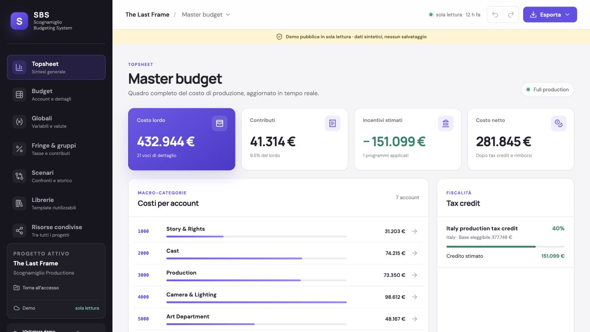
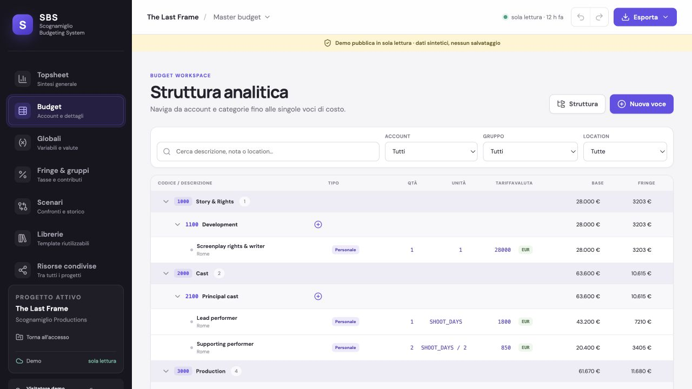

# Scognamiglio Budgeting System (SBS)

[Italiano](README.it.md) · [Try the read-only demo](https://scognamiglio1969.github.io/scognamiglio-budgeting-system/?demo=1) · [Cloud login](https://scognamiglio1969.github.io/scognamiglio-budgeting-system/) · [Roadmap](ROADMAP.md) · [Contributing](CONTRIBUTING.md)

SBS is an open-source production budgeting platform for film, television, documentary, commercial and audiovisual projects. It combines hierarchical budgets, reusable production resources, multi-project collaboration and a secure PostgreSQL backend.

> **Project status:** public beta. Use real production data only after reviewing the deployment, backup and security guidance.

## Live demo

Explore a complete synthetic production budget without creating an account. The public demo is read-only, never saves changes and contains no real production data.

**[Open the SBS interactive demo →](https://scognamiglio1969.github.io/scognamiglio-budgeting-system/?demo=1)**

## Screenshots

[](https://scognamiglio1969.github.io/scognamiglio-budgeting-system/?demo=1)

*Topsheet — real-time production totals, account breakdown and estimated incentives.*

[](https://scognamiglio1969.github.io/scognamiglio-budgeting-system/?demo=1)

*Budget detail — navigable Accounts, Categories and individual cost lines.*

## Why SBS

- **Production-native structure:** Topsheet → Accounts → Categories → Details.
- **Powerful calculations:** Globals, formulas, fringes, contribution caps, currencies and tax incentives.
- **Multi-project workspace:** separate budgets with shared departments, rates, packages and templates.
- **Controlled collaboration:** Admin-managed users and project roles (`owner`, `editor`, `viewer`).
- **Data ownership:** self-host the complete application and export an administrative JSON backup.
- **Open format:** import/export SBS JSON, CSV, Excel and printable PDF reports.

## Feature overview

- Instant Topsheet totals and one-click hierarchical navigation.
- Safe formula parser with global dependency recalculation.
- Configurable union, tax and insurance fringes with wage caps.
- Multiple currencies and editable exchange-rate tables.
- Location and category-based production incentives.
- Sub-budgets, independent scenarios and account-level comparisons.
- Persistent undo/redo, audit trail and recoverable project versions.
- Reusable line-item, crew-rate, equipment, global, fringe and group libraries.
- Encrypted IndexedDB recovery cache and optimistic cloud autosave.
- Guided legacy `.mbd`/`.mmbx` migration path.

## Quick start

Requirements: Node.js 20 or newer and a Supabase project.

```bash
git clone https://github.com/Scognamiglio1969/scognamiglio-budgeting-system.git
cd scognamiglio-budgeting-system
npm install
cp .env.example .env.local
npm run dev
```

Open `http://127.0.0.1:4173/`. Add your browser-safe Supabase URL and publishable key to `.env.local` before signing in.

For the database, authentication and Edge Function setup, follow [Cloud setup](docs/CLOUD_SETUP.md). For an independent installation, see [Self-hosting](docs/SELF_HOSTING.md).

## Validation

```bash
npm test
npm run build
```

## Architecture

- `src/engine.ts` — formulas and calculation engine.
- `src/types.ts` — budget data model.
- `src/store.ts` — autosave, history, undo and redo.
- `src/RootApp.tsx` — authentication, project workspace and cloud sync.
- `src/secureCache.ts` — AES-GCM encrypted IndexedDB recovery cache.
- `src/views/` — operational budgeting views.
- `src/exporters.ts` — CSV, JSON and OpenXML Excel exports.
- `supabase/migrations/` — PostgreSQL schema, RLS and version history.
- `supabase/functions/` — privileged user administration functions.

## Legacy compatibility

The file picker recognizes `.mbd` and `.mmbx` and opens a guided migration workflow. Direct binary parsing is not enabled because the legacy format has no public specification. The verifiable path is a Movie Magic JSON Advanced export mapped into SBS. Direct compatibility will require legally obtained sample files and repeatable validation fixtures.

SBS is an independent project and is not affiliated with or endorsed by Movie Magic, Entertainment Partners, SAG-AFTRA, DGA or IATSE. Third-party names are used only to describe compatibility targets and production workflows.

## Contributing and security

Read [CONTRIBUTING.md](CONTRIBUTING.md) before opening a pull request. Please report vulnerabilities through [GitHub private vulnerability reporting](https://github.com/Scognamiglio1969/scognamiglio-budgeting-system/security/advisories/new), not through a public issue. See [SECURITY.md](SECURITY.md) for the complete policy.

## License and trademarks

Copyright © 2026 Massimo Scognamiglio.

The source code is licensed under the [GNU Affero General Public License v3.0](LICENSE). The names **SBS**, **Scognamiglio Budgeting System**, and associated branding are not granted by the software license; see [TRADEMARKS.md](TRADEMARKS.md).
